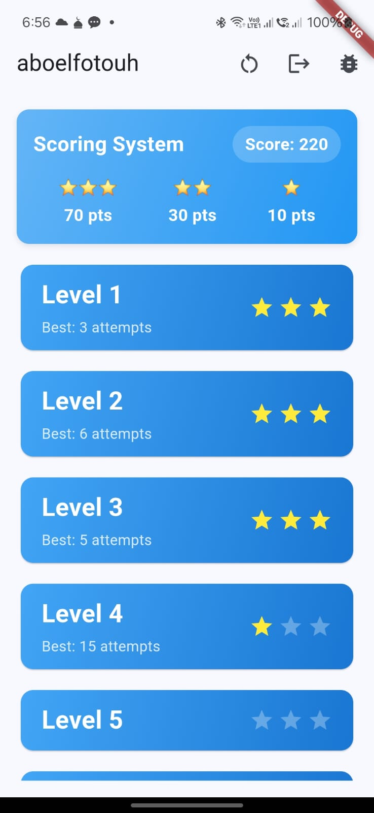
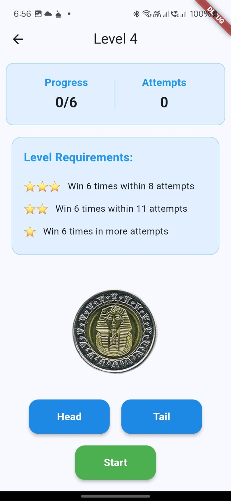
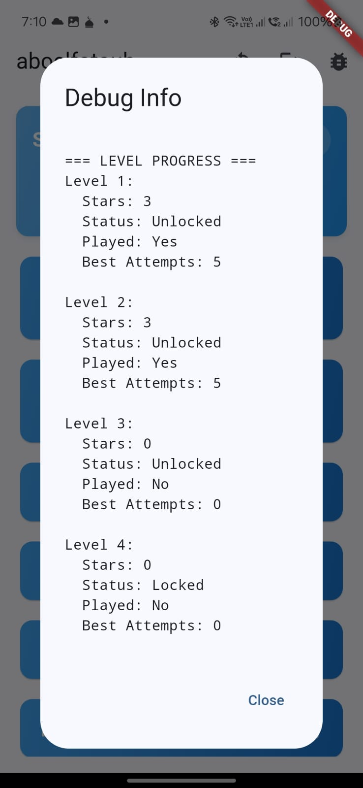
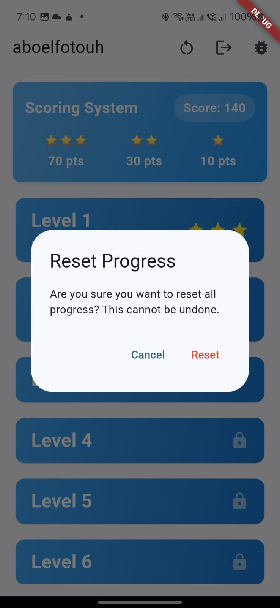

# Flip Coin Game

A progressive level-based coin flip game built with Flutter.

## Features

### Game Mechanics
- 10 challenging levels
- Progressive difficulty system
- Star-based scoring system
- Animated coin flipping
- Level requirements display
- Real-time progress tracking

### Scoring System
- 3 stars = 70 points
- 2 stars = 30 points
- 1 star = 10 points
- No stars = 0 points

### Level Requirements
Each level has unique requirements:
- Level 1: 3 wins (5/8 attempts for 3/2 stars)
- Level 2: 4 wins (6/9 attempts for 3/2 stars)
- Level 3: 5 wins (7/10 attempts for 3/2 stars)
- Level 4: 6 wins (8/11 attempts for 3/2 stars)
- Level 5: 7 wins (9/12 attempts for 3/2 stars)
- Level 6: 8 wins (10/13 attempts for 3/2 stars)
- Level 7: 9 wins (11/14 attempts for 3/2 stars)
- Level 8: 10 wins (12/15 attempts for 3/2 stars)
- Level 9: 11 wins (13/16 attempts for 3/2 stars)
- Level 10: 12 wins (14/17 attempts for 3/2 stars)

### UI Features
- Responsive design for all screen sizes
- Animated coin flips
- Visual feedback for correct/wrong guesses
- Progress tracking display
- Star rating visualization
- Level completion animations
- Total score display
- Locked/unlocked level indicators

### Game Progress
- Automatic progress saving
- Best score tracking per level
- Level unlocking system
- Persistent user data
- Score calculation system

## Technical Details

### State Management
- Uses StatefulWidget for game state
- SharedPreferences for data progress
- Custom ProgressService for game progress

### Animations
- Coin flip animation using AnimationController
- Result display animations
- Score counting animations

### Responsive Design
- Dynamic font scaling
- Flexible container sizing
- Proper overflow handling

### Data Models
- LevelProgress for tracking level status
- LevelRequirement for level configurations
- Score calculation system

## Setup Instructions

1. Clone the repository
2. Run `flutter pub get`
3. Ensure assets are properly linked
4. Run the app using `flutter run`

## Dependencies
- flutter
- shared_preferences
- math
- cupertino_icons

## Screenshots

### Home Screen

- Main game menu
- Level selection
- Score display
- Star ratings for each level
- Progress tracking

### Game Screen

- Coin flip animation
- Level requirements
- Progress tracking
- Head/Tail selection
- Score system

### Debug Mode

- Testing interface
- Game mechanics verification
- Performance monitoring
- State inspection

### Reset Progress

- Progress reset confirmation
- User data management
- Clean state initialization
- Save data handling

